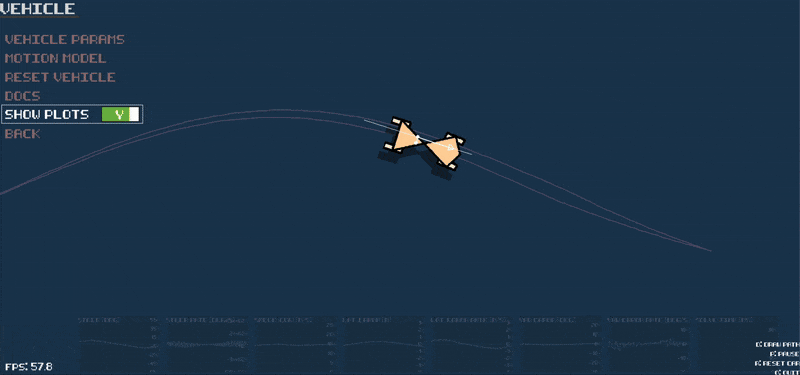

<a id="readme-top"></a>

<div style="text-align: center;">
    
</div>


[](https://www.linkedin.com/in/jam643/)


<!-- TABLE OF CONTENTS -->
<details>
  <summary>Table of Contents</summary>
  <ol>
    <li>
      <a href="#about-this-project">About This Project</a>
    </li>
    <li>
      <a href="#gameplay-mode">Gameplay Mode</a>
    </li>
    <li>
      <a href="#sandbox-mode">Sandbox Mode</a>
      <ul>
        <li><a href="#path-tracking-controllers">Path Tracking Controllers</a></li>
        <li><a href="#vehicle-model">Vehicle Model</a></li>
        <li><a href="#path-generation">Path Generation</a></li>
      </ul>
    </li>
    <li><a href="#setup">Setup</a></li>
    <li><a href="#contact">Contact</a></li>
  </ol>
</details>

## About This Project

This over-engineered game is my attempt to brush up on vehicle dynamics and path tracking algorithms by coding them from scratch. The game conceals an underlying framework of tunable path tracking controllers (Pure-Pursuit, Stanley, Kinematic/Dynamic LQR), customizable vehicle dynamics models, spline-based path generation, etc.

<p align="right">(<a href="#readme-top">back to top</a>)</p>

## Gameplay Mode

The game involves the user drawing a path (B-spline) with their mouse that the autonomous vehicle will follow using one of several path tracking algorithms. The goal is to guide the AV safely to the end of each level, avoiding collisions with the walls.


<p align="right">(<a href="#readme-top">back to top</a>)</p>

## Sandbox Mode

Sandbox mode allows the user to interactively experiment and tune a variety of parameters, controlling everything from the vehicle dynamics model to the path tracking algorithms and tuning parameters. The code is written following several OOP software design patterns (Composite, Factory, Bridge, etc.) to enable abstraction (e.g. any controller can be run with any vehicle model and any path generation type) and maintainability.

<p align="right">(<a href="#readme-top">back to top</a>)</p>

### Path Tracking Controllers

Users can tune (in realtime) and experiment with several path tracking controllers of varying complexity. See below video for example: 


Brief comparison of the various path tracking controllers implemented:

|                        | **Description**                                                                                                                            | **Model Used**                  | **Robustness**                                                        | **Stability**                                                                           | **Linearity**                     |
| ---------------------- | ------------------------------------------------------------------------------------------------------------------------------------------ | ------------------------------- | --------------------------------------------------------------------- | --------------------------------------------------------------------------------------- | --------------------------------- |
| **Pure Pursuit**       | Geometric method that follows a look-ahead point on the path based on vehicle speed                                                        | Kinematic, simple bicycle model | Less robust to dynamic changes, struggles with sharp turns            | Generally stable but can lose stability in sharp turns, high speeds, or small lookahead | Non-linear                        |
| **Stanley Controller** | Minimizes cross-track error and heading error through a proportional control strategy, used in DARPA's Grand Challenge by Standford's team | Kinematic, bicycle model        | Robust to small disturbances, but may oscillate in certain conditions | Lyapunov stable, particularly for straight paths                                        | Non-linear                        |
| **Kinematic LQR**      | Uses linear quadratic regulator to minimize deviations in position and velocity using a kinematic model                                    | Kinematic, linearized model     | Moderately robust with careful tuning                                 | Stable within the Region of Attraction (ROA)                                            | Linearized around operating point |
| **Dynamic LQR**        | Uses linear quadratic regulator to minimize deviations including dynamic effects like forces and acceleration                              | Dynamic, linearized model       | Highly robust, especially in dynamic and high-speed environments      | Stable within the Region of Attraction (ROA)                                            | Linearized around operating point |


Users can also click the `Docs` button to go to [a Jupyter Notebook page](https://github.com/jam643/TheTrolleyProblemGame/blob/master/control/docs/Path%20Tracking%20Controls.ipynb) containing derivations of some of the control strategies as well as sample code calling the controllers:


<p align="right">(<a href="#readme-top">back to top</a>)</p>

### Vehicle Model

The user can switch between kinematic vs dynamic vehicle models as well as different integration schemes. The user can also update the vehicle model parameters (mass, length, etc) in real time which will also update the parameters used by the path tracking algorithm (where relevant).


Users can also click the `Docs` button to go to [a Jupyter Notebook page](https://github.com/jam643/TheTrolleyProblemGame/blob/master/dynamics/docs/VehicleMotionModel.ipynb) containing derivations of the dynamic/kinematic bicycle model equations-of-motion as well as sample code calling the models:



<p align="right">(<a href="#readme-top">back to top</a>)</p>

### Path Generation

Paths are generated with B-Splines for $C^2$ continuity. There are 2 path generation modes:

1) Manual Gen: path spawns from the mouse cursor which the user controls
2) Auto Gen: path is generated by some parameterizable function generator (e.g. sine wave)

<p align="right">(<a href="#readme-top">back to top</a>)</p>

## Setup

First time only:
```bash
pip install --user pipenv
pip install --user pipenv-shebang
pipenv sync
pipenv run ipykernel_setup
```
Start game:
```bash
./TheTrolleyProblemGame.py
```

<p align="right">(<a href="#readme-top">back to top</a>)</p>

<!-- CONTRIBUTING -->
## Contributing

Contributions are what make the open source community such an amazing place to learn, inspire, and create. Any contributions you make are **greatly appreciated**.

If you have a suggestion that would make this better, please fork the repo and create a pull request. You can also simply open an issue with the tag "enhancement".
Don't forget to give the project a star! Thanks again!

1. Fork the Project
2. Create your Feature Branch (`git checkout -b feature/AmazingFeature`)
3. Commit your Changes (`git commit -m 'Add some AmazingFeature'`)
4. Push to the Branch (`git push origin feature/AmazingFeature`)
5. Open a Pull Request


<!-- CONTACT -->
## Contact

Jesse Miller - jam643@cornell.edu

Project Link: [https://github.com/jam643/TheTrolleyProblemGame](https://github.com/jam643/TheTrolleyProblemGame)

<p align="right">(<a href="#readme-top">back to top</a>)</p>